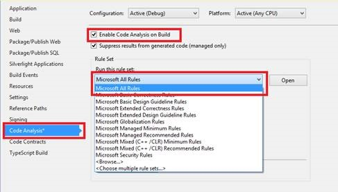
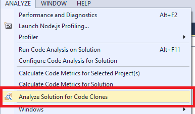

# Matter Center for Office 365
## Coding guidelines
### Table of contents

* [C# Naming Guidelines](#namingguidelines)
* [C# Code Commenting](#commenting)
* [C# Flow Control](#controlflow)
* [General Guidelines](#generalguidelines)
* [Anti-XSS (Cross site scripting vulnerabilities)](#antixss)
* [Exception Handling](#exceptions)
* [Essential Tools](#tools)
* [HTML Guidelines](#htmlguidelines)
* [CSS Guidelines](#cssguidelines)
* [JavaScript coding Guidelines](#jsguidelines)
	* [Naming convention](#jsnaming)
	* [General Guidelines](#jsgeneral)
* [JQuery Guidelines](#jqueryguidelines)

## <a name='namingguidelines'></a>C# Naming Guidelines

```bash
"c" = camel Case
"P" = Pascal Case
"_" = Prefix with _Underscore
"x" = Not Applicable
```
|Identifier|Public|Protected|Internal|Private|Notes|
|:--------:|:----:|:-------:|:------:|:-----:|:---:|
|Method|P|P|P|P|<div style='text-align:left;'>Use a Verb or Verb-Object pair</div>|
|Property|P|P|P|P|<div style='text-align:left;'>Do not prefix with Get or Set.</div>|
|Field|P|P|P|c|<div style='text-align:left;'>Only use Private fields.<br>No Hungarian Notation!</div>|
|Constant|x|x|x|x|<div style='text-align:left;'>Constants should be all in Uppercase with words separated by underscore. <br><div style='text-align:left;'>Example:<br>public class SomeClass<br>{<br>const int DEFAULT_SIZE = 100;<br>}</div></div>|
|Static Field|P|P|P|||
|Enum|P|P|P|P|<div style='text-align:left;'>Options are also Pascal Case</div>|
|Delegate|P|P|P|P||
|Event|P|P|P|P||
|Parameter|x|x|x|c||
|Project File|P|x|x|x|<div style='text-align:left;'>Match Assembly & Namespace.</div>|
|Source File|P|x|x|x|<div style='text-align:left;'>Match contained class.</div>|
|Class|P|P|P|P||
|Structure|P|P|P|P||
|Interface|P|P|P|P|<div style='text-align:left;'>Prefix with a capital **I**.|
|Generic Class|P|P|P|P|<div style='text-align:left;'>Use T or K as Type identifier<br><br><div style='text-align:left;'>//correct<br>public class LinkedList`<K,T>`<br>{...}<br><br>//incorrect<br>public class LinkedList`<KeyType,DataType>`<br>{...}</div></div>|
|Attribute Class|P|P|P|P|<div style='text-align:left;'>Suffix custom attribute classes with Attribute</div>|
|Exception Class|P|P|P|P|<div style='text-align:left;'>Suffix custom exception classes with Exception</div>|
|Resources|P|x|x|x|<div style='text-align:left;'>Use Pascal casing in resource keys</div>|
|Local Variable within Methods|c|c|c|c||
|Global Variable|P||||||

## <a name='commenting'></a>C# Code Commenting

*	Run StyleCop to identify the commenting related issues
*	Indent comments at the same level of indentation as the code you are documenting
*	Run spell check on all comments. Misspelled comments indicate sloppy development. Best way to cover for this is the spell checker add-in available in Visual Studio 2010 and higher.
*	Write all comments in the same language, be grammatically correct, and use appropriate punctuation
*	Use // or /// but never /* … */
*	Use inline-comments to explain assumptions, known issues, and algorithm insights
*	Do not use inline-comments to explain obvious code. Well written code is self-documenting
*	Only use comments for bad code to say “fix this code” – otherwise remove, or rewrite the code
*	Include comments using Task-List keyword flags to allow comment-filtering

**Example:**
```csharp
// TODO: Place Database Code Here
// UNDONE: Removed P\Invoke Call due to errors
// HACK: Temporary fix until able to refactor
```
*	Always apply C# comment-blocks (///) to public, protected, and internal declarations.
*	Only use C# comment-blocks for documenting the API
*	Always include `<summary>` comments. Include `<param>`, `<return>`, and `<exception>` comment sections where applicable
*	Use Section tags to define different sections within the type documentation. 

|Section Tags|Description|Location|
|---|---|---|
|`<summary>`|Short description|type or member|
|`<remarks>`|Describes preconditions and other additional information.|type or member|
|`<param>`|Describes the parameters of a method|Method|
|`<returns>`|Describes the return value of a method|Method|
|`<exception>`|Lists the exceptions that a method or property can throw|method, even or property|
|`<value>`|Describes the type of the data a property accepts and/or returns|Property|
|`<example>`|Contains examples (code or text) related to a member or a type|type or member|
|`<seealso>`|Adds an entry to the See Also section|type or member|
|`<overloads>`|Provides a summary for multiple overloads of a method|First method in an overload list.|
* Provide the following information at the top of each page. This information is mandatory:

|File|Name of the file with extension.|
|---|---|
|Project:|Name of the project.|
|Solution:|Name of the solution.|
|Author:|Author who created this page. |
|Date:|Date of page creation.|
|Description:|Brief summary of the page.|
|Change History:|This provides the information about changes made to the file after creation. |

Typical example is given below.

```csharp
#region Page Summary
/// *****************************************************************
///
/// File:     BasePage.cs
/// Project:     ConMan
/// Solution:     ConMan
///
/// Author:    ______
/// Date:    December 22, 2006
/// Description: This file defines the BasePage for all other pages.
/// Contains functionality common to all the pages.
///
/// Change History:
/// Name        Date            Version        Description
/// -------------------------------------------------------------------------------
/// ____________    March 05, 2005        1.0.1.2        Created
/// -------------------------------------------------------------------------------
/// Copyright (C) <copyright information of the client>.
/// -------------------------------------------------------------------------------
#endregion
```

## <a name='controlflow'></a>C# Flow Control

*	Use the ternary conditional operator only for trivial conditions. Avoid complex or compound ternary operations.

**Example:**
```csharp
int result = isValid ? 9 : 4;
```

*	Avoid evaluating Boolean conditions against true or false.

**Example:**

```csharp
// correct
if (isValid){...}

//incorrect
if (isValid == true){...}
```

*	Avoid assignment within conditional statements

**Example:**

```csharp
if ((i=2)==2) {…}
```

*	Avoid compound conditional expressions – use Boolean variables to split parts into multiple manageable expressions. 

**Example:**
```csharp
// correct
isHighScore = (value >= _highScore);
isTiedHigh = (value == _highScore);
isValid = (value < _maxValue);
if ((isHighScore && !isTiedHigh) && isValid)
{...}

//incorrect
if (((value > _highScore) && (value != _highScore)) && (value < _maxScore))
{...}
```

*	Only use switch/case statements for simple operations with parallel conditional logic.
*	Prefer nested if/else over switch/case for short conditional sequences and complex conditions.
*	Prefer polymorphism over switch/case to encapsulate and delegate complex operations. Use TryParse for conversions like integer, decimal, date etc. in place of direct conversions like ToInt32(), ToDatetime() etc.

## <a name='generalguidelines'></a>General Guidelines

*	Do not omit access modifiers. Explicitly declare all identifiers with the appropriate access modifier instead of allowing the default.

**Example:**

```csharp
//correct
private void WriteEvent(string message)
{...}

//incorrect
void WriteEvent(string message)
{...}
```

*	Avoid explicit properties that do nothing but access a member variable. Use automatic properties instead.

**Example:**

```csharp
// correct
class MyClass
{
    int m_Number;
    public int Number
    {
        get{ return number; }
        set{ number = value; }
    }
}	

//incorrect
class MyClass
{
    public int Number { get; set; }
}
```

*	Never hardcode strings that will be presented to end users. Use resources instead
*	Use StringBuilder class instead of String when you have to manipulate string objects in a loop.
*	Run StyleCop to check formatting
*	Never declare more than one namespace per file
*	Avoid putting multiple classes in a single file
*	Always place curly braces ({ and }) on a new line
*	Always use curly braces ({ and }) in conditional statements
*	Place namespace “using” statements together at the top of file. Group .NET namespaces above custom namespaces
*	Use #region to group related pieces of code together.
*	Only declare related attribute declarations on a single line, otherwise stack each attribute as a separate declaration. 

**Example:**

```csharp
//correct
[Attrbute1, RelatedAttribute2]
[Attrbute3]
[Attrbute4]
public class MyClass
{...}

//incorrect
[Attrbute1, Attrbute2, Attrbute3]
public class MyClass
{...}
```

*	Always prefer C# Generic collection types over standard or strong-typed collections.
*	Prefer String.Format() or StringBuilder over string concatenation.
*	Do not compare strings to String.Empty or “” to check for empty strings. Instead, compare by using String.Length == 0
*	Avoid explicit casting. Use the as operator to defensively cast to a type. 

**Example:**

```csharp
Dog dog = new GermanShepherd();
GermanShepherd shepherd = dog as GermanShepherd;
if(shepherd != null)
{...}
```

*	Constant variables do not allocate memory. So it is always recommended to use constant variables instead of static variables         
*	For example:  const int NUMBER_SAMPLE= 4;    
*	Read-only static variables can be assigned a dynamic value during initialization which is not possible with constants
*	E.g. private readonly static int TotalCount = //Some method which returns the count
*	Also, constants are not allocated memory. When an application is compiled, the value of the constant is embedded in the assembly during compile time. Now if the dll containing the Constant changes the value of the constant, the main application has to be recompiled to reflect the new constant value. However, in case of read only static variables, their value is looked up at runtime and hence no recompilation of the main application is required.

## <a name='antixss'></a>Anti-XSS (Cross site scripting vulnerabilities)

*	To avoid cross-site scripting there are two things that need to be done:
    * Verify Input - Constrain the acceptable range of input characters. 
    * Encode Input - Use HttpUtlitity.HtmlEncode when displaying input back to user.

*	Encode Input using HttpUtility.HtmlEncode
*	Use the HttpUtility.HtmlEncode method to encode output if it contains input from the user, such as input from form fields, query strings, and cookies or from other sources, such as databases. Do not write the response back without validating or encoding the data. 

**Example:**
```csharp
Response.Write(HttpUtility.HtmlEncode(Request.Form["name"]));
```

*	Use AntiXSS base class library for ASP.NET 4.5 projects.

**Example:**
```csharp
AntiXssEncoder.HtmlEncode("dasd", true);
```
## <a name='exceptions'></a>Exception Handling


*	Do not use try/catch blocks for flow-control
*	catch only those exceptions that you can handle
*	Never declare an empty catch block
*	Avoid nesting a try/catch within a catch block
*	While re-throwing an exception, preserve the original call stack by omitting the exception argument from the throw statement. 

**Example:**

```csharp
//correct
catch(Exception)
{
    Log(ex);
    throw;
}

//incorrect
catch(Exception ex)
{
    Log(ex);
    throw ex;
}
```

*	Use the finally block to release resources from a try statement.
*	Always use validation to avoid exceptions.

**Example:**
```csharp
//correct
if(conn.State != ConnectionState.Closed)
{
    conn.Close();
}

//incorrect
try
{
    conn.Close();
}
catch(Exception ex)
{
    // handle exception if already closed!
}
```

*	Always set the innerException property on thrown exceptions so the exception chain & call stack are maintained.
*	Avoid defining custom exception classes. Use existing exception classes instead.

## <a name='tools'></a>Essential Tools

|Name|Version|Description|Project Type|
|---|---|---|---|
|Visual Studio 2013 Code Analyzer|2013 (Update 2)||NA|
|StyleCop|4.7|Analyzes C# source code to enforce a set of style and consistency rules|Web|
|Visual Studio 2013 Code Clone |2013 (Update 2)||NA|

## <a name='htmlguidelines'></a>HTML Guidelines

* **Use of  HTML5 Block Level Elements**<br>
Instead of staying with divs for everything, take some time to learn the new HTML 5 elements like <header>,<footer>, <article> and others. They work the same way but improve readability
```html
/* Recommended */
<body>
    <header>
        ...
    </header>
    <article>
        ...
        <section>
            ...
        </section>
        ...
    </article>
    <footer>
        ...
    </footer>
</body>
```
```html
/* Not recommended */
<body>
    <div id="header">
        ...
    </div>
    <div id="main">
            ...
    </div>
    <div id="footer">
        ...
    </div>
</body>  	
```
* **Client side data storage**<br>
Use local storage or session storage introduced with HTML5 rather than cookies
[Reference](http://technobytz.com/cookies-vs-html-5-web-storage-comparison.html)<br>
Always check applicability of storage type for requirement in hand
* **ALT attribute for image tag**<br>
Always use ALT attribute with an image tag. This will help in case image does not load because of connection issues

## <a name='cssguidelines'></a>CSS Guidelines

* **Avoid use of inline CSS**<br>
Never use inline CSS, always separate your content from presentation
* **Placement of CSS file**<br>
Place your CSS file reference in a head tag of HTML page<br>
or <br>
If Header is not present, include reference before other page content (In cases like SharePoint content editor web part)
* **Property ordering**<br>
Put declarations in alphabetical order in order to achieve consistent code in a way that is easy to remember and maintain.
```css
background: fuchsia;<br>
border: 1px solid;<br>
color: black;<br>
text-align: center;<br>
```
One more suggestion is to group it logically in following order
    * Display
    * Positioning
    * Box model
    * Colors and Typography
    * Other
<br><br>You can select any of these, but make sure that it is consistent. 

* **Naming convention**<br>
Use Pascal naming convention.<br>
Avoid using class names like “purple”, “big”, “largeText” or “margin50”. Class names should describe the element or collection, not the style - the CSS properties describe the style. If that color changes you would have to modify your HTML to change the appearance, which defeats the idea of separation of styles from content. Or worse, you would have a class name called “purple” when the background-color might be declared red.

* **Organizing style sheet**<br>
Organize the Stylesheet with a Top-down Structure. It always makes sense to lay your CSS file out in a way that allows you to quickly find parts of your code. One option is a top-down format that tackles styles as they appear in the source code. So, an example CSS file might be ordered like this:
Generic classes (body, a, p, h1, etc.)
```css
#header
#nav-menu
#main-content
```

* **Shorthand Properties**<br>
CSS offers a variety of shorthand properties (like font) that should be used whenever possible, even in cases where only one value is explicitly set.
Using shorthand properties is useful for code efficiency and understandability.
```css
/* Recommended */
border-top: 0;
font: 100%/1.6 palatino, georgia, serif;
padding: 0 1em 2em;
/* Not recommended */
border-top-style: none;
font-family: palatino, georgia, serif;
font-size: 100%;
line-height: 1.6;
padding-bottom: 2em;
padding-left: 1em;
padding-right: 1em;
padding-top: 0;
```

* **Avoid a universal key selector**<br>
Never apply styles using universal selector
```css
/* Not recommended */
 * 
{
    margin: 0;
    padding: 0;
}
```

Use all CSS relative to topmost element created for report

* **Remove redundant qualifiers**
These qualifiers are redundant:
    1.	ID selectors qualified by class and/or tag selectors
    2.	Class selectors qualified by tag selectors (when a class is only used for one tag, which is a good design practice anyway)
    3.	It's easy to unknowingly add extra selectors to our CSS that clutters the stylesheet. In some cases you need to add this to apply more specific styles, but in most of the case there will be optimal way to achieve this
```css
/* Recommended */
#example {}
.error {}
.someclass li {...}
/* Not recommended */
ul#example {}
div.error {}
body #container .someclass ul li {....}
```

## <a name='jsguidelines'></a>JavaScript Coding Guidelines

### <a name='jsnaming'></a>Naming convention:

*	Names should not be too small like ex1, i, j, k etc. or should not be very large. Iterator variables in the loops can be an exception here.
*	Name should be simple, easy, readable and most importantly SHORT 
*	Names should not start with a numeral (0-9). Such names will be illegal.
*	Variable Names:
    *	Use Lower Camel Case (variableNameShouldBeLikeThis) for variable names. 
        *	Name should start with single letter which defines it's data type. This helps the developer to know the behavior of the variable and gets an idea about what kind of data it has in it.
        *	Refer to the table below for some of the data types widely used along with the conventions. 

|#|Data Type|Prefix letter|Sample Variable Name|
|---|---|---|---|
|1|int|i|iCounter|
|2|Float|f|fPrice|
|3|Boolean|b|bFlag|
|4|String|s|sFullName|
|5|Object|o|oDiv|

*	Constants: There is nothing as constants in JavaScript. But if you want for particular variable developer should not try to modify the value then the name should be in all capital letters (CONSTANTNAME). Specify the prefix similar to above table.
*	Function Names / Method Names:
    *	JavaScript function/method names should use Lower Camel Casing (functionNamesLikeThis)
        *	In case your function returns a value. Prefix the function name with the letter indicating the type of values returned. Refer table mentioned above for Prefixing a letter for variable names.
        *	Function names should be intuitive and should use concise words explaining the existence of the function. 
        *	For e.g.: if you want to name a code block that checks whether the user is of legal age or not for driving, you name the function as  “isAboveEighteen()”  while this seems to serve the purpose but a more appropriate function name would be “isLegalAge()”. 

### <a name='jsgeneral'></a>General Guidelines

*	Declarations with var: Always
*	Prefer ' over "
    *	JS allows both single quotes or double quotes
    *	But for consistency single-quotes (') are preferred to double-quotes ("). This is helpful when creating strings that include HTML.
```javascript
var msg = 'This is some "HTML"';
```
*	Always use semicolons to terminate JS statements
*	Cache the length in the loops.
```javascript
Correct 	Incorrect 
//correct
var foo = document.getElementsByTagName('p'); 
for(var i=0, len=foo.length; i<len; i++) {}; 
//incorrect
var foo = document.getElementsByTagName('p'); 
for(var i=0; i<foo.length; i++) {}; 
```
*	Use {} Instead of new Object() 
```javascript
Correct 	Incorrect 
//correct
var o = { 
   name: 'Jeffrey', 
   lastName = 'Way', 
   someFunction : function() { 
      console.log(this.name); 
   }};
//incorrect
var o = new Object(); 
o.name = 'Jeffrey'; 
o.lastName = 'Way'; 
o.someFunction = function() 
{
    console.log(this.name); 
} 
```
*	Use [] Instead of new Array() 
*	Always use strict comparison ( === Instead of == )
*	Using try/catch (Note: Exceptions Are For Exceptional Cases)
    *	Try/catch are expensive
    *	Do not use nested try/catch, instead use try/catch at the topmost level
    *	Do not ignore exceptions
```javascript
//correct
try {
    doStuff();
} catch(ignore) {
    log(ignore);
}
//incorrect
try {
    doStuff();
} catch(ignore) {
    // Do nothing, just ignore.
}
```
    * Do not use try/catch within loops. 
```javascript
//correct 
try {
    while(condition) {
        stuff();
    }
} catch(e) {
    log(e);
}
//incorrect
while(condition) {
    try {
        stuff();
    } catch(e) {
        log(e);
    }
}
``` 
*	Curly Love, use curly braces it even if it is not necessary. 
```javascript
//correct
var bCheck = true;
if(bCheck) {
    alert(bCheck);
}
else {
    alert(bCheck);
}	
//incorrect
var bCheck = true;
if(bCheck)
    alert(bCheck);
else
    alert(bCheck);
```
* Minimize DOM access: Accessing DOM elements with JavaScript is slow so in order to have a more responsive page, you should: 
<br>Cache references to accessed elements: 
```javascript
var msg = document.getElementById('someDiv') //store(cache) the object in a variable
if (msg)
{
    msg.style.display = 'none'
}
```
*	Perform null checks for the object before accessing or updating any of its properties. Refer below the sample for same
```javascript
//correct
var msg = document.getElementById('someWrongDivName') 
if (msg)
{
    msg.style.display = 'none'
}
else
{
    alert('No error shown')
}
//incorrect
var msg = document.getElementById('someWrongDivName') 
msg.style.display = 'none' //msg is null here
```
## <a name='jqueryguidelines'></a>JQuery Guidelines

*	Use ID selector whenever possible. Finding a DOM element by its ID is the fastest way, both in JavaScript and in jQuery. Whenever possible, you should always use the ID selector instead of using classes or tag names, or other ways.
*	Avoid Loops. Nested DOM Selectors can perform better. Avoid unnecessary loops. If possible, use the selector engine to address the elements that are needed
*	Don't mix CSS with jQuery
*	Avoid multiple $(document).ready() calls
*	$.ajax performs a massive amount of work to allow us the ability to successfully make asynchronous requests across all browsers. You can use $.ajax method directly and exclusively for all your AJAX requests
*	If we have an element with id “refiner” and we want to add two classes “addColor” and “addBackground”, we can do it by putting the two class names in addClass method separated by a space.
*	Leverage Event Delegation (a.k.a. Bubbling). Every event (e.g. click, mouseover, etc.) in JavaScript “bubbles” up the DOM tree to parent elements. This is incredibly useful when we want many elements (nodes) to call the same function. Instead of binding an event listener function too many nodes — very inefficient — you can bind it once to their parent, and have it figure out which node triggered the event. For example, say we are developing a large form with many inputs, and want to toggle a class name when selected.

```javascript
// Inefficient
$('#myList li').bind('click', function(){
$(this).addClass('clicked');
    // do stuff
});
// Instead, we should listen for the click event at the parent level:
$('#myList).bind('click', function(e){
    var target = e.target, // e.target grabs the node that triggered the event.
    $target = $(target);  // wraps the node in a jQuery object
    if (target.nodeName === 'LI') {
        $target.addClass('clicked');
        // do stuff
    }
});
```